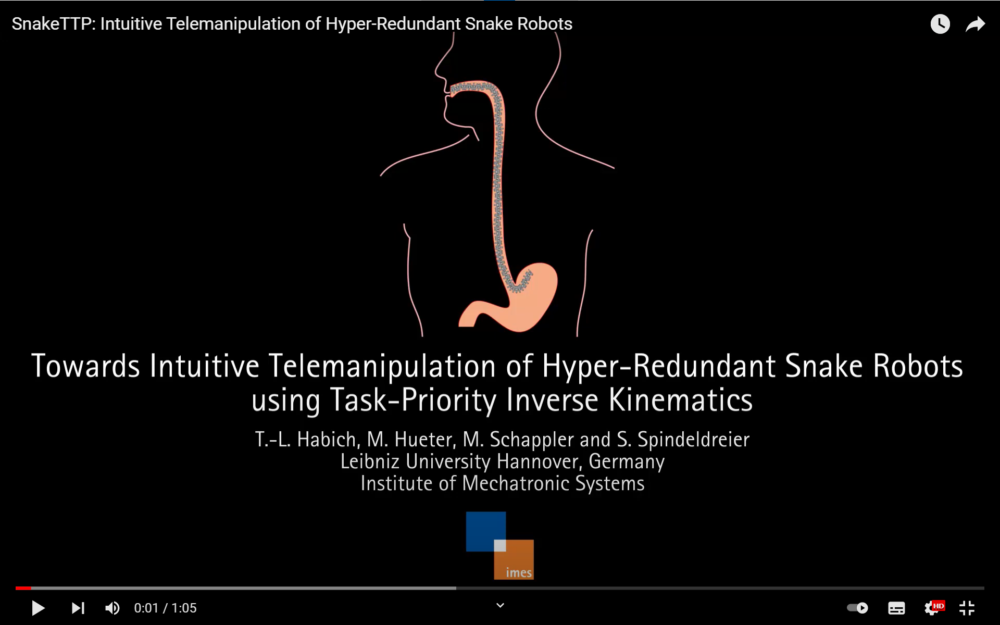
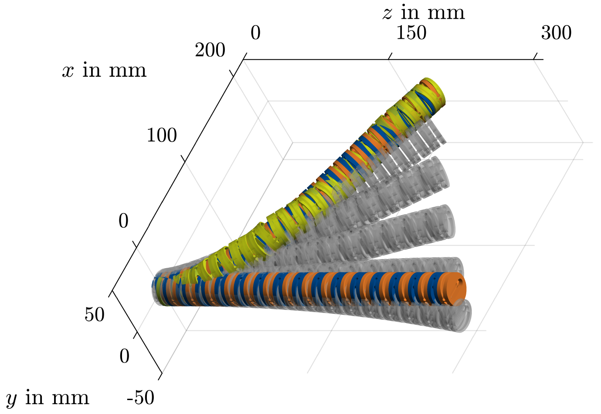

# Snake Telemanipulation using Task-Priority
SnakeTTP is a unified telemanipulation strategy which enables follow-the leader locomotion and reorientation keeping the shape change as small as possible. The basis for this is a novel shape fitting approach for solving the inverse kinematics in only a few milliseconds. Shape fitting is performed by maximizing the similarity of two curves using Fréchet distance while simultaneously specifying the position and orientation of the end effector. This approach shows a fast convergence which is essential for online path planning. The code is part of a conference paper for publication at IEEE International Conference on Robotics and Automation (ICRA) 2023. You can find a detailed description of SnakeTTP [in our paper](https://arxiv.org/pdf/2303.00065.pdf).
<p align="center">
  <a href="https://youtu.be/oIpbxpJPoyQ" />
    
  </a>
</p>

## Getting Started
The packages [set_based_task_priority_ik](https://github.com/tlhabich/set_based_task_priority_ik), [matlab_toolbox](https://github.com/SchapplM/matlab_toolbox), [robotics-dep-ext](https://github.com/SchapplM/robotics-dep-ext), [discrete-frechet-distance](https://github.com/mp4096/discrete-frechet-distance) and [robotics-toolbox](https://github.com/SchapplM/robotics-toolbox) are necessary. The path is initialized running
```
$ init_path.m
```

## Shape Fitting
Matlab functions of forward kinematics and (geometric) Jacobians of all robot's links are required. In the *functions* folder you can find these functions for snake robots with alternating single-axis pitch and yaw joints. If needed, the DH parameters can be adjusted. The functions can be mex-compiled using Matlab:
```
$ matlabfcn2mex({'fkine_num'})
$ matlabfcn2mex({'jgeom_num'})
```  
The proposed shape fitting approach can be found in *functions/shape_fitting.m*. Using task-priority inverse kinematics, the snake's shape can be fitted to a desired configuration. To obtain a desired end effector pose, this task is performed on top priority. The shape fitting is performed by means of null space projection considering joint limits of the hyper-redundant system. Validation of shape fitting can be found in *shape_fitting_validation/shape_fitting_validation.m* and validation of pivot reorientation in *pivot_validation/pivot_validation.m*. Based on these minimal examples, online path planning approaches such as snake telemanipulation (see our paper) can be realized.
<p align="center">
</a>
  
</a>
</p>

## Citation
If you use this method for your research, please cite the following publication:
```
Intuitive Telemanipulation of Hyper-Redundant Snake Robots within Locomotion and Reorientation using Task-Priority Inverse Kinematics
Habich, T.-L., Hueter, M., Schappler, M., Spindeldreier, S.
IEEE International Conference on Robotics and Automation (ICRA) 2023
```
## Contact
* [Tim-Lukas Habich](https://www.imes.uni-hannover.de/de/institut/team/m-sc-tim-lukas-habich/), Leibniz University Hannover, Institute of Mechatronic Systems (tim-lukas.habich@imes.uni-hannover.de)
