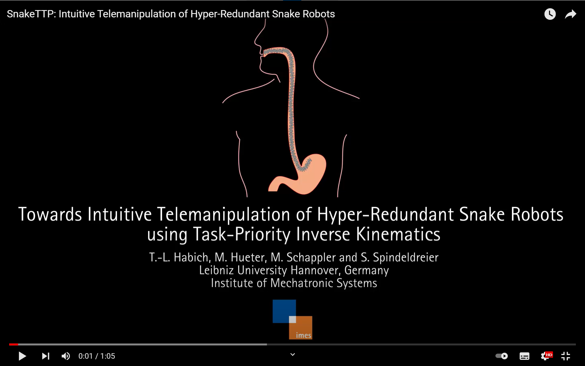
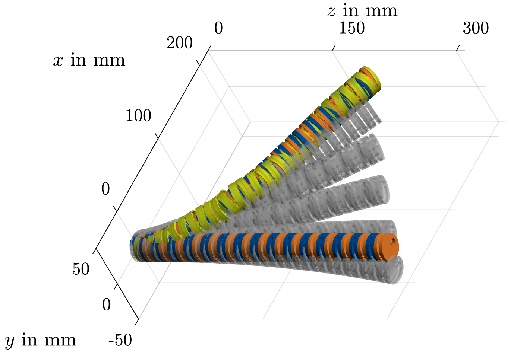
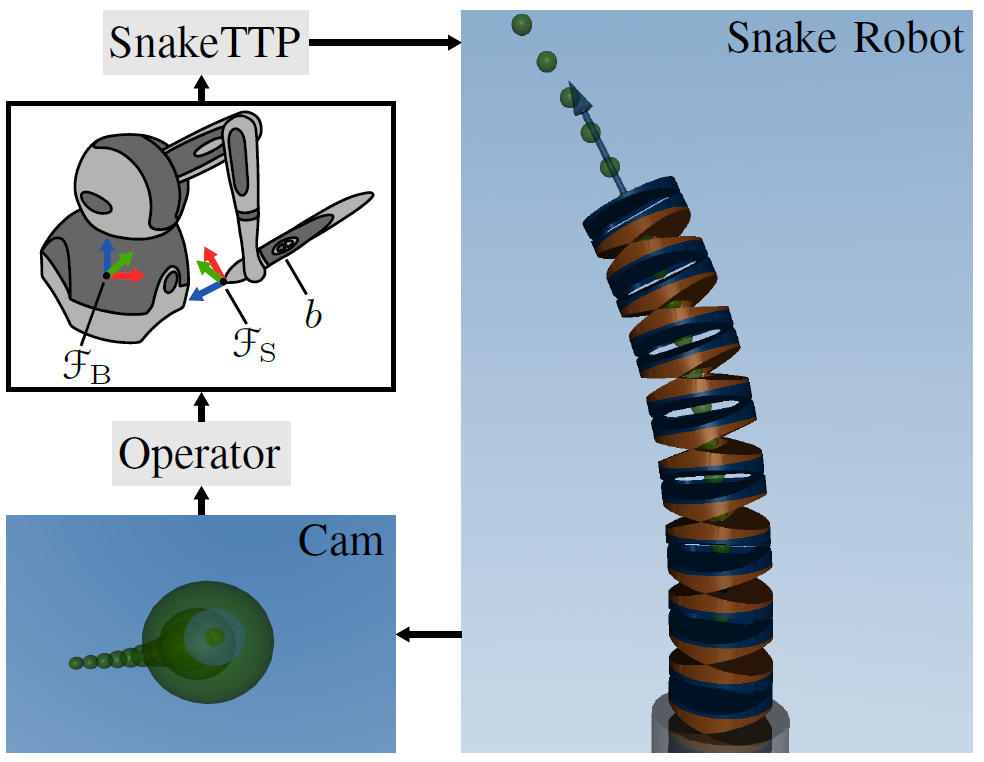

# Snake Telemanipulation using Task-Priority
SnakeTTP is an algorithm for intuitive telemanipulation of hyper-redundant snake robots realizing follow-the-leader motion for endoscopic tasks. The new shape fitting method uses task-priority inverse kinematics and allows different position and orientation specifications for each link. This approach shows a fast convergence which is essential for online path planning. The code is part of a conference paper submitted for publication at IROS 2022. You can find a detailed description of SnakeTTP in our paper.
<p align="center">
  <a href="https://www.youtube.com/watch?v=dv4SBmW4p_4" />
    
  </a>
</p>

## Table of Contents

* [Getting Started](#getting-started)
* [Usage](#usage)
  * [Snake Kinematics](#snake-kinematics)
  * [Shape Fitting](#shape-fitting)
  * [Telemanipulation](#telemanipulation)
* [Citation](#citation)  
* [Contact](#contact)

## Getting Started
The packages [set_based_task_priority_ik](https://github.com/tlhabich/set_based_task_priority_ik), [matlab_toolbox](https://github.com/SchapplM/matlab_toolbox), [robotics-dep-ext](https://github.com/SchapplM/robotics-dep-ext) and [robotics-toolbox](https://github.com/SchapplM/robotics-toolbox) are necessary. The path is initialized running
```
$ init_path.m
```
## Usage

### Snake Kinematics
Matlab functions of forward kinematics and (geometric) Jacobians of all robot's links are required. In the kinematics folder you can find these functions for snake robots with alternating single-axis pitch and yaw joints. If needed, the DH parameters can be adjusted. The functions can be mex-compiled using Matlab:
```
$ matlabfcn2mex({'fkine_num'})
$ matlabfcn2mex({'jgeom_num'})
```  
### Shape Fitting
The proposed shape fitting approach can be found in *kinematics/shape_fitting.m*. Using task-priority inverse kinematics, the snake's shape can be fitted to a desired configuration. To obtain a desired end effector pose, this task is performed on top priority. The shape fitting is performed by means of null space projection considering joint limits of the hyper-redundant system:
<p align="center">
</a>
  
</a>
</p>

### Telemanipulation
**Will be added in the next days.**
<p align="center">
</a>
  
</a>
</p>

## Citation
If you use this software for your research, please cite the following publication:
```
TODO
```
## Contact
* [Tim-Lukas Habich](https://www.imes.uni-hannover.de/de/institut/team/m-sc-tim-lukas-habich/), Leibniz University Hannover, Institute of Mechatronic Systems (tim-lukas.habich@imes.uni-hannover.de)
